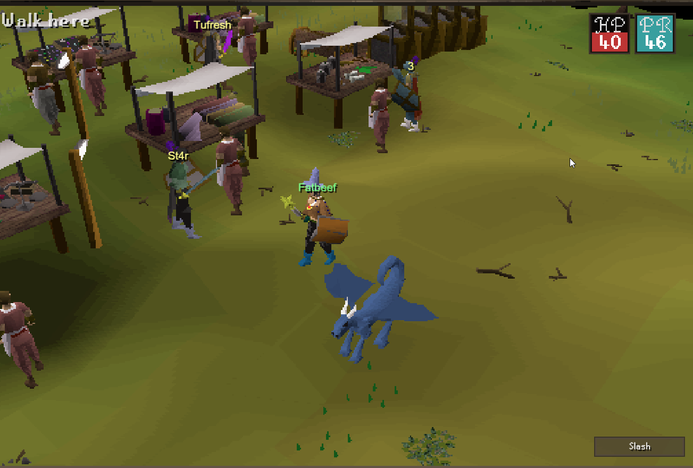
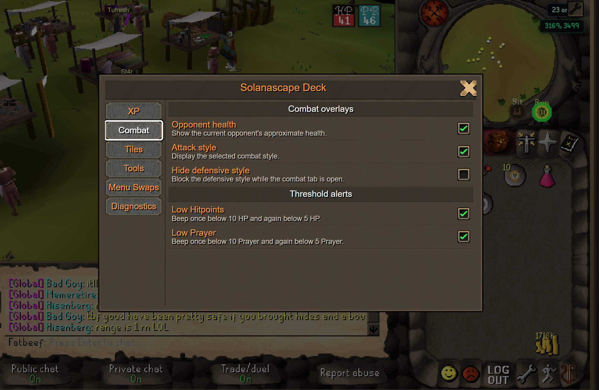
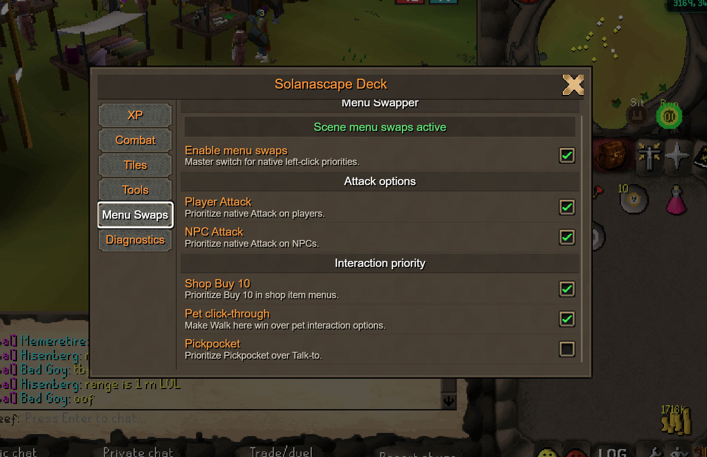

# Solanascape Deck

Solanascape Deck is a Tampermonkey userscript that adds OSRS/RuneLite-style quality-of-life overlays to the Solanascape browser client.

It is a local browser enhancement: it reads validated client state, renders isolated Shadow DOM overlays, and applies native menu-entry priority swaps. It does not send packets, automate gameplay, or phone home.



## Features

- XP drops and temporary XP progress globes.
- Opponent health, selected attack style, and low HP/Prayer alerts.
- Tile indicators for hovered and destination tiles.
- Ground item labels with compact stack quantities.
- Player names above nearby characters, with combat levels when available.
- Clue helper panel with recent clue text capture and coordinate locating.
- Menu swaps for player/NPC Attack, Pickpocket, shop Buy 10, and pet click-through.
- Redacted diagnostics for compatibility reports.





## Install

1. Install [Tampermonkey](https://www.tampermonkey.net/).
2. Open the userscript raw URL:
   `https://raw.githubusercontent.com/flashbits-eth/solanascape-deck/main/dist/solanascape-deck.user.js`
3. Accept the Tampermonkey install prompt.
4. Reload `https://solanascape.online/play`.
5. Open Deck settings with the wrench in the upper-right of the game canvas.

Tampermonkey will use the script metadata to check the same raw URL for updates.

## Safety

Please review userscripts before installing them. Solanascape Deck is intended to stay inside this boundary:

- No runtime network requests.
- No packet inspection or packet modification.
- No synthetic clicks, key presses, pointer events, or gameplay input.
- No game-canvas input handlers.
- No automatic diagnostic uploads.
- No raw `gameClient` exposure through the public diagnostics API.

Menu Swapper only reorders complete native menu entries. Your actual click still follows Solanascape's original client action path.

This is a community QoL userscript, not an official Solanascape client. Client updates can break individual features; broken mappings should fail closed where possible.

## Build From Source

Requirements: Node.js 24+ and npm.

```powershell
npm install
npm run verify
```

Useful commands:

- `npm run build` creates `dist/solanascape-deck.user.js`.
- `npm run test` runs unit and Shadow DOM tests.
- `npm run typecheck` runs strict TypeScript checking.
- `npm run audit` verifies the local-only/no-synthetic-input boundary.

## Project Layout

- `src/main.ts`: bootstrap and plugin registration.
- `src/adapter.ts`: read-only normalized client API.
- `src/mapping.ts`: versioned obfuscated-field fallback map.
- `src/plugins/`: individual features.
- `src/ui/`: Shadow DOM settings UI and embedded OSRS styling.
- `src/menu-swapper-core.ts`: native menu-entry priority handling.

See `PRIVACY.md`, `SECURITY.md`, and `docs/client-state.md` for more detail.
